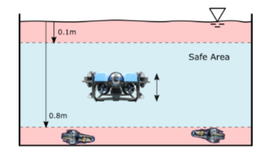
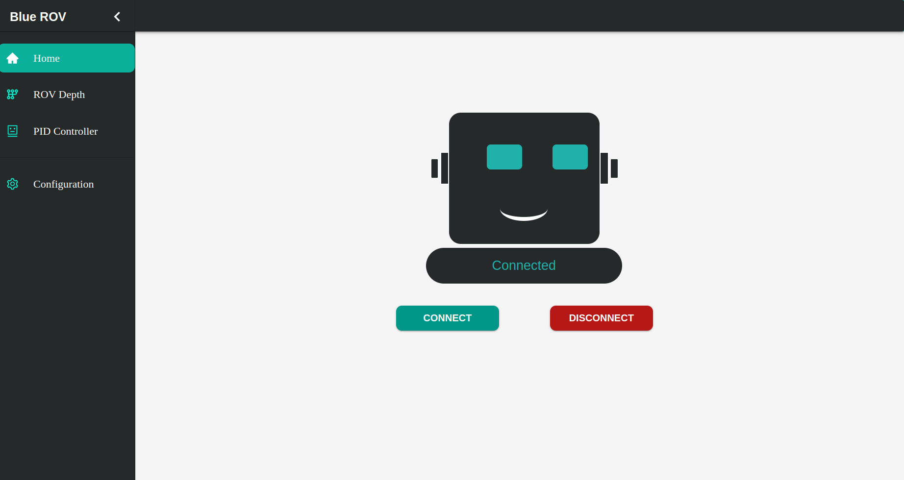

#  DepthController

This repository consists of four package:
- **fav** : contains the main model , simulation environment ,gazebo plugins, etc.
- **depth_controller**: the main package in which the PID controller is applied in depth_controller_node.py
- **tf_casting**: this package was created to provide a tf broadcasting , we needed it in our web view. 
- **web_ui**: a simple dashboard that add some features such as:
  - Robot connection status.
  - Moving buttons in various directions.
  - Force stop button for emergency cases.
  - Dynamic target depth publisher which allows users to send target depth with a single click.
  - Tracking the current depth value .
  - Adjusting the PID parameters dynamically.
  - Displaying the current overshoot, and some other prop-
  erties.
  
  

  
  

  
  ## Getting Started
  
  ### Installation ###
   1. Go to your ROS package source directory:
      - `$ cd ros_workspace_path/src`
   2. Clone this project.
      - `$ git clone git@github.com:AbdelrahmanAbounida/assignment1-depth_controller.git`
   3. Go back to your ROS workspace:
      - `$ cd ../`
   4. Build and install it:
      - `$ catkin build
   5. Reload your ROS env.
      - bash: `$ source devel/setup.sh`
      - zsh: `$ source devel/setup.sh`

## Running ##

- Main simulation node
    - `roslaunch fav_sim gazebo_apriltag_tank_world.launch`
    
- BLUEROV model node
    - `roslaunch fav_sim spawn_vehicle.launch`

- Depth controller node
    - `roslaunch depth_controller depth_control.launch`

- tf_casting
    - `rosrun tf_casting rov_tf2_broadcaster.py`

## Web Dashboard ##
  

  
  

  
 - installation
    - `roscd web_ui/src/ui`
    - `npm inistall`
    
- edit the websocket ip
    -  `roscd web_ui/src/ui/src/features/RosConnection `
    -  `ifconfig` # to get the local ip address of your device
    -  `cat RosConnectionSlice.js`
    -  edit  `const rosbridge_address ="your_ip"`

- open websocket connection to the local running roscore
    - `sudo apt-get install ros-<rosdistro>-rosbridge-server`
    - `roslaunch rosbridge_server rosbridge_websocket.launch`

- start connecting 
    - `roscd web_ui/src/ui/`
    - `npm run start`
- have fun with the tool
    

 :star::star::star: 
 

